# EmoTrak - BackEnd

## ✨ 프로젝트 소개 🔮

- 오늘 나의 기분은 어땠을까? 나의 감정을 털어놓을 곳 Emotion Tracking Diary, EmoTrak[이모트랙] 입니다.

[📝 EmoTrak 바로가기](https://emotrak.vercel.app/) | [⭐️ 팀 노션](https://1nxeo.notion.site/4-EmoTrak-0e155b9e771b4c659480f406933151f6)

 

### 🧡 EmoTrak 💛

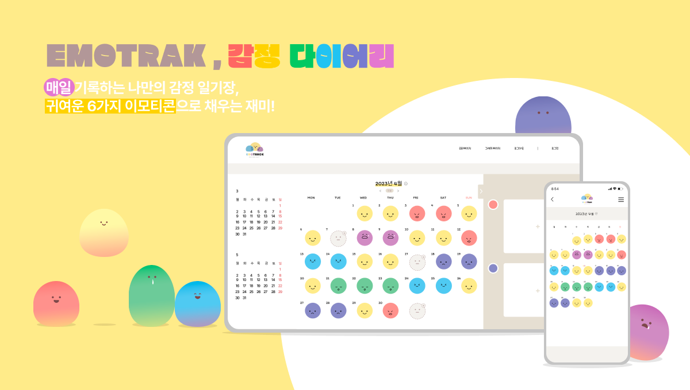

 

### 📆 프로젝트 기간

- 2023/03/31 ~ 2023/05/04

 

### 🖥️ 서비스 아키텍쳐

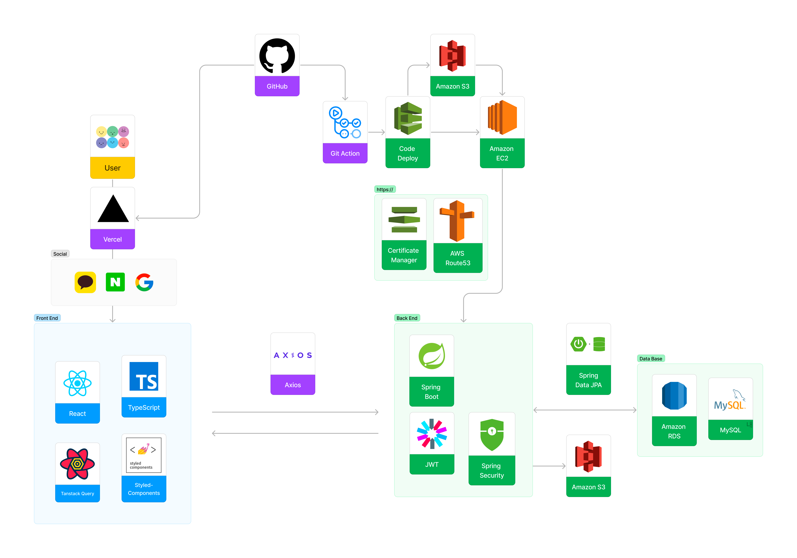

 

### 🥕 Back-end 기술적 의사결정

#### RefreshToken

- 로그인 유지 시간을 오래 지속되게 하여 편의성을 개선하도록 도입
- RefreshToken을 사용하여 자동으로 새로운 AccessToken을 안전하게 발급
- 짧은 AccessToken 만료 기간과  적당한 RefreshToken 만료 기간으로 보안 측면 고려

#### https 배포

- 개인정보 보호를 위해 도입
- 통신 과정에서 전송되는 데이터를 암호화하여 해킹과 데이터 도난을 예방
- 인증서를 통해 서버의 신원을 검증하여 안전한 통신을 보장

#### Cloud Front

- 글로벌 엣지 로케이션 네트워크를 통해 사용자에게 더 가까운 곳에서 콘텐츠를 제공하여 사용자들의 로딩시간 및 빠른 콘텐츠 전송 속도와 낮은 지연 시간을 보장
- 캐싱 기능을 통해 오리진 서버의 부하를 줄여주며, 이를 통해 인프라 비용을 절감
- 캐시 동작 및 요청 처리에 CORS 관련 헤더를 추가하는 정책을 설정하여 클라이언트와 서버 간의 다른 출처에 대한 요청을 안전하게 처리 및 CORS(교차 출처 리소스 공유) 대응

#### Swagger

- 팀 간 효율적인 소통을 위해 도입
- API를 문서화하여 구조와 기능을 쉽게 이해
- 테스트 가능한 사용자 인터페이스 제공
- API 호출을 직접 실행해보며 결과를 확인할 수 있어 테스트 및 디버깅 과정이 효율적으로 진행

#### CI/CD

- 수동으로 빌드와 배포를 반복, 이를 해결하기 위해 도입
- 자주 빌드하고 테스트하므로 버그를 더 빨리 발견하고 수정할 수 있음

#### 회원 탈퇴 및 소셜 연동 해제

- 소셜 연동된 회원이 탈퇴를 진행 후 다시 회원가입시 연동된 내역이 있어 가입 동의가 이루어지지 않음
  → 탈퇴가 이루어졌는지 직관적으로 보이지 않아 소셜 연동을 해제하는 부분을 추가
- 구글로 가입된 회원은 로그인시 발급된 accessToken과 refreshToken을 사용하여 탈퇴를 진행해야 하는데 처음 로그인시에만 발급됨
  → 로그인시 발급된 **refreshToken**토큰을 DB에 저장하여 탈퇴를 진행하기 직전 accessToken을 발급받아 탈퇴를 진행하는데 사용

 

### 🎨 ERD Table

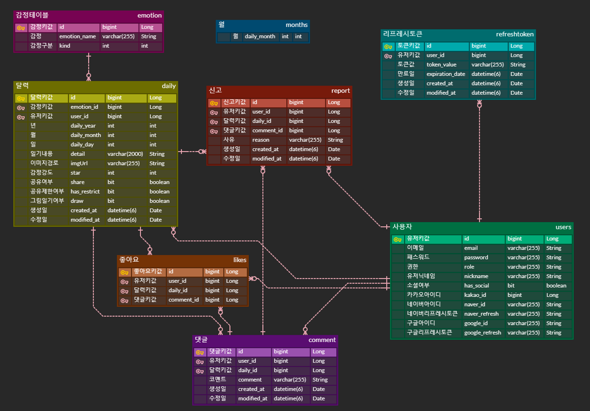

 

### 💻 백엔드 기술 스택 & 라이브러리 

   

     

    

   

  

 

### 🔧 주요 기능

✏️ 감정일기 작성

- 그날의 감정을 일기로 작성하고 그림이나, 사진으로 감정을 표현할 수 있음
- 감정 이모티콘과 별점을 선택하여 하루의 기분을 이모티콘과 별점으로 나타낼 수 있음

📆 달력으로 그 날의 대표감정 알아보기

- 월 별 감정을 기록하여 해당 월 대표감정을 달력에 표시
- 감정 클릭 시 해당 일에 기록된 감정 확인

📊 차트를 통해 자신의 감정 통계 확인하기

- 월 별 나의 감정별 평균 점수 및 어떤 감정이 많았는지 감정 빈도 확인

👀 다른 사람들의 공유한 감정을 확인, 댓글달기

- 다른 사람들이 공유한 감정을 확인 하고, 좋아요 및 댓글을 달아서 소통을 할 수 있음
- 부적절한 게시물 또는 댓글을 신고하면 관리자가 모니터링 하여 삭제, 공유해제 가능

📱반응형 웹

- 반응형 웹 구현으로 모바일이나 태블릿으로도 서비스를 이용할 수 있도록 접근성 높임.

 

### 🔧 트러블 슈팅

글로벌 예외 처리를 적용하여 유효성 검사

| 진행 순서 | 내용                                                                                                                                       |
| :-------- |:-----------------------------------------------------------------------------------------------------------------------------------------|
| 😱 문제   | @Valid 어노테이션을 사용하여 유효성 검사를 진행     → 글로벌 예외 처리 이외에 따로 controller에서 예외 처리를 해줘야하므로 통일성이 어긋남                                             |
| 😭 시도   | @Valid 어노테이션을 대체할 여러가지 방법을 알아보고 , @Validated어노테이션 기능 및 @Valid나 @Validated에서 글로벌 예외 처리로 작동하게 끔 시도                                         |
| 😄 해결   | 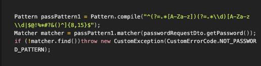   Pattern 객체를 사용해서 compile기능으로 해당 정규식을 저장하고 Matcher 객체로 매칭 값을 저장 후 matcher의 find() 기능으로 유효성 검사를 하여 글로벌 예외 처리 |

리프레시 토큰

| 진행 순서 | 내용                                                                                                      |
| :-------- |:--------------------------------------------------------------------------------------------------------|
| 😱 문제   | 리프레시 토큰으로 엑세스 토큰을 재발급 시도 시 엑세스 토큰이 만료된 상황에서 재발급할 유저가 인증객체에서 가져와지지 않음                                    |
| 😭 시도   | 로그인 시 유저 정보를 리프레시 토큰과 함께 저장하여 재발급 시도 시 유저 정보를 리프레시 토큰으로 검색                                              |
| 😄 해결   | 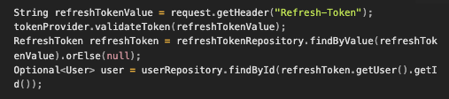   엑세스 토큰이 만료되었을 경우 DB에 리프레시 토큰의 유효기간을 체크해서 해당 리프레시 토큰의 유저를 검색해서 엑세스 토큰을 재발급 |

통계 조회

| 진행 순서 | 내용                                                                                                                                                                                              |
| :-------- |:------------------------------------------------------------------------------------------------------------------------------------------------------------------------------------------------|
| 😱 문제   | 등록된 내역만 조회 → 등록이 되지 않은 월과 감정도 모두 조회로 수정, 이를 해결하기 위해 query를 짜는 부분에 어려움이 있었음                                                                                                                      |
| 😭 시도   | 1. LEFT JOIN → 등록되지 않은 월 뿐만 아니라 감정도 모두 보이도록 해야하므로 실패   2. 모든 월에 대해 select 한 후 union all로 조회 → 코드가 너무 길어짐                                                                                    |
| 😄 해결   | 1월부터 12월을 등록한 테이블을 만든 후 CROSS JOIN하여 원하는 결과를 얻을 수 있었음    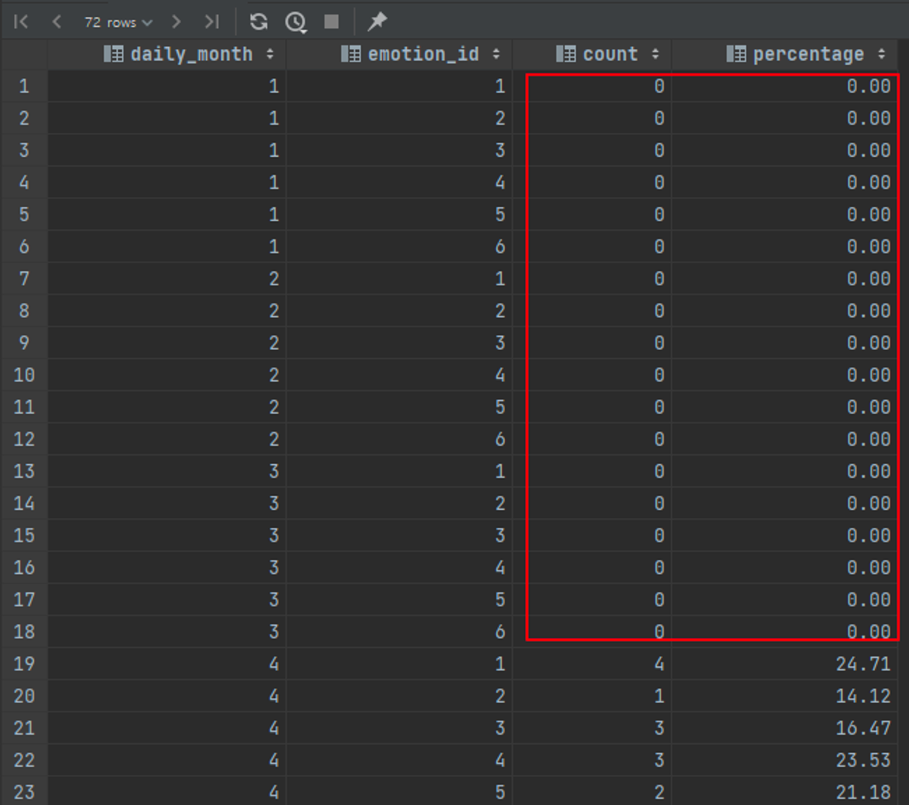   mySql에서는 오류가 없었지만 H2에서는 month가 예약어 오류가 있어 컬럼명을 수정함 month → daily_month   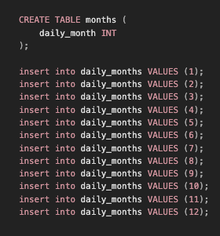 |

그림일기 수정 - S3 CORS

| 진행 순서 | 내용                                                                                                                                                                                                                                                                                                                                                                                                                                                                                                                                                                                                                                                                                                                                                                                                                                                                                                                                |
| :-------- |:----------------------------------------------------------------------------------------------------------------------------------------------------------------------------------------------------------------------------------------------------------------------------------------------------------------------------------------------------------------------------------------------------------------------------------------------------------------------------------------------------------------------------------------------------------------------------------------------------------------------------------------------------------------------------------------------------------------------------------------------------------------------------------------------------------------------------------------------------------------------------------------------------------------------------------|
| 😱 문제   | S3에 저장된  img_url 을 불러와서 캔버스에 그려주는데서 문제(CORS)가 발생   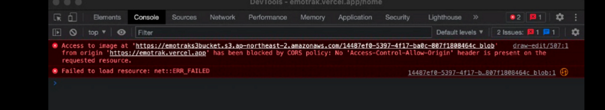   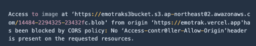                                                                                                                                                                                                                                                                                                                                                                                                                                                                                                                                                                                                                                                                                                                                                                                                                      |
| 😭 시도   | 1. S3 버킷에 저장된 객체의 메타데이터 확인 (Content-Type 및 Access-Control-Allow-Origin 헤더)    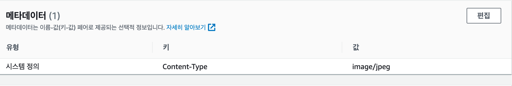   “S3 버킷에 저장된 객체의 메타데이터 확인”을 알아보았다. Content-type은 올바르지만  **Access-Control-Allow-Origin 이** 설정되어 있지 않았다. 하지만 해당이슈는 Content-Type 만 제대로 세팅되어 있고 CORS 정책 처리에 AllowedOrigin 만 잘 세팅되어 있다면 관련 없는 문제라고 한다   2. 버킷의 CORS 정책 와일드카드 사용   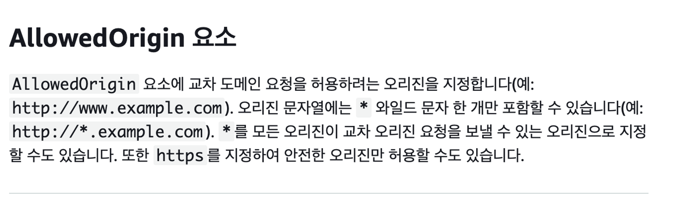   ("https://*.emotrak.vercel.app"은 서브도메인에 대한 설정이며, "https://emotrak.vercel.app/*"은 경로에 대한 설정입니다.)   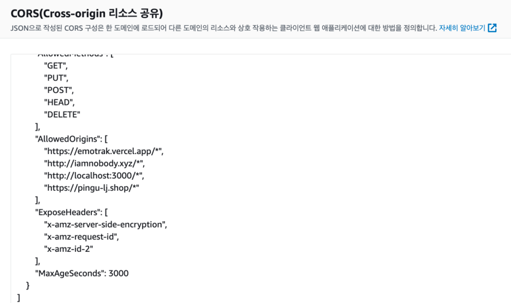   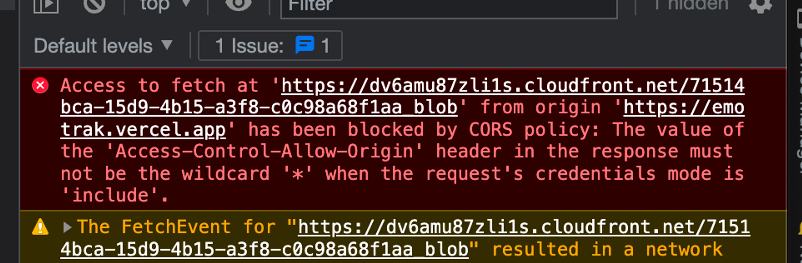   현재 프런트에서 진행하고 있는 canvas는 *(와일드카드) 를 사용할 수 없기 때문에 해당 방법으로는 진행을 할 수 없었다.  3. CloudFront도입   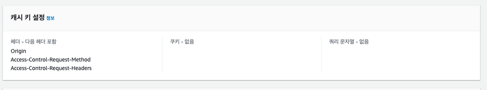   CloudFront 배포의 동작(Behaviors) 설정에서 Origin, Access-Control-Request-Headers, Access-Control-Request-Method 헤더를 포함하도록 설정   헤더의 반환 value 값 비교    변경 전   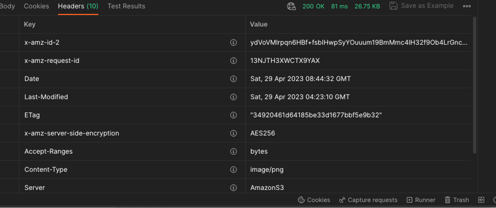   변경 후   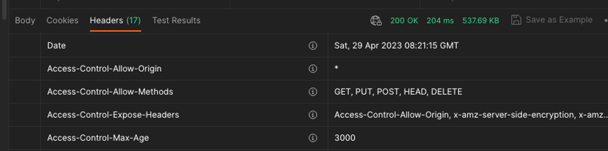 |
| 😄 해결   | 1. `access-control-allow-origin` 이 헤더에 없어서 발생하는 CORS에러니 헤더에 `access-control-allow-origin`  이 어떻게든 들어가도록 해야한다.   2. CloudFront도입   - 요청을 넣을때에 request header 에 `Origin`을 넣으면 response header에 `access-control-allow-origin` 을 넣어 내려보내준다.   - CloudFront에서는 request header에 Origin을 설정할 수 있다.   - S3를 바라보는 CloudFront를 생성하고 request header Origin을 설정하니 response header에 `access-control-allow-origin` 이 담겨서 내려왔고 CORS 에러가 해결되었다!!   (CloudFront는 중간다리 역할이라서 원본에게 요청을 보내는 Request 세팅도 할 수 있고, CloudFront에 접근하는 쪽(주로 클라이언트)에 응답을 하는 Response 세팅도 할 수 있다)                                                                                                                                                                                                                                                                                                                                                         |

 

### 🌹 About Back-end

#### 👪 &nbsp; 팀원

|   이름   |            깃허브 주소             |                                          역할 분담                                          |
|:------:|:-----------------------------:|:---------------------------------------------------------------------------------------:|
| 👑 이진  |  https://github.com/JinguLee  |        일기장 월별 일별 조회   게시글 전체, 상세 조회   회원 탈퇴   신고된 글 공유 중지   게시글 , 댓글 신고 삭제        |
| 👦 서영석 | https://github.com/corand-seo |                       막대그래프, 원그래프 조회   신고 게시글 조회   신고 댓글 조회   SSL 도입                       |
| 👦 박문주 | https://github.com/parkmj4312 |                                 일반 로그인   리프레쉬 토큰   이메일 인증                                 |
| 👧 홍다정 |  https://github.com/bambee83  | 게시글 CUD   S3 버킷 , CloudFront 관리   댓글 CUD   소셜 로그인 연동 및 연동해제   게시물, 댓글 좋아요 기능   게시물, 댓글 신고 기능 |

